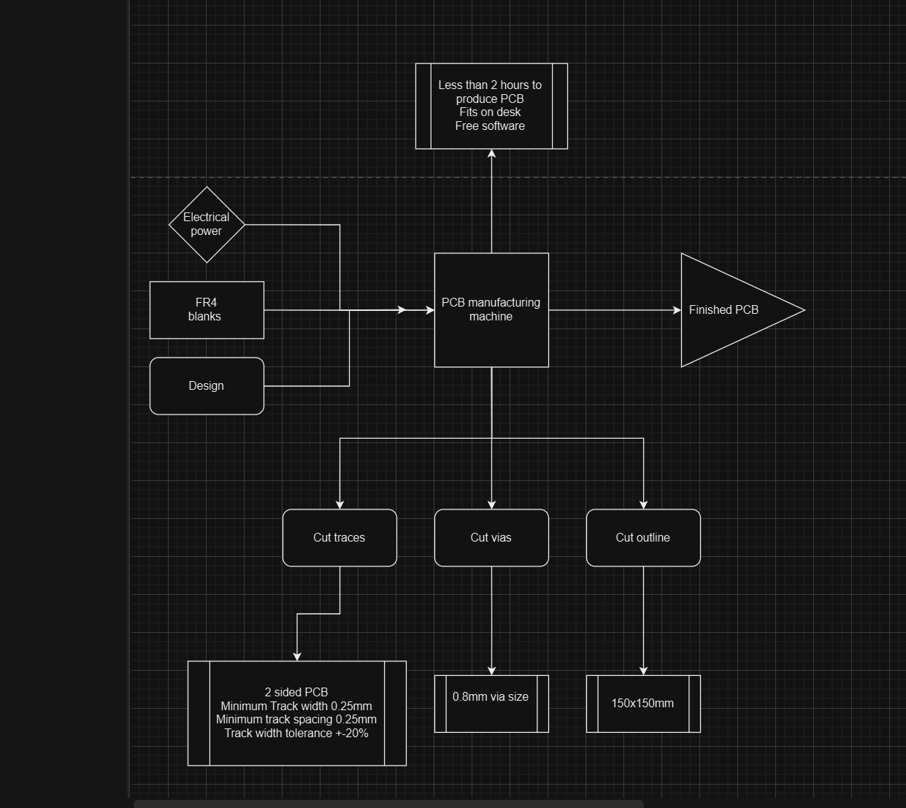

# A-PCB mill

Making PCBs for a hobbyist can be frustrating because of lead times. While it is incredible that we can get high quality PCBs from manufacturers within a week, there are still some significant gripes to contend with.

- **Shipping can be expensive**  
  Sometimes you just want a small, simple PCB which will cost 5 dollars, but then you get a shipping fee of 20 dollars which can really make you think twice about whether you actually need that PCB.

- **Rapid prototyping is not possible**  
  A one-week lead time is impressive, but can still be too slow. If you need the PCB to continue the project, you really can't do anything until they arrive. If you made a mistake, you then have to repeat the process which can become incredibly time consuming and frustrating. And paying for faster shipping just makes the whole process more expensive.

Our solution to this would be to make a highly accessible and inexpensive PCB mill that almost any mid to high level electronics enthusiast could use. The purpose of this mill would not be to replace purchasing of PCBs from actual manufacturers. This mill would serve as a way to make "draft" PCBs that the user could test and verify before sending the design to an actual manufacturer. (If users are satisfied with the quality of the draft PCBs they could just use those in their projects too if they wish.)

# Target Audience

There are those that enjoy tinkering and fixing their machines, but there are also those that just want something that works. Our machine would mostly target people who want a PCB mill mostly to use as a tool, not as a hobby. This would mean creating a mill with a solid workflow that doesn't require much intervention from the user.

## Selling Points

In order of importance, aspects of out machine that could distinguish it from others

1) Ease-of-use
   1) Lower the tedium of using the mill as much as possible 
2) Reliability
   1) Keep the failure rate as low as possible.
3) Accuracy
   1) The ability to mill better PCBs

# Possible Solutions

- Convert a 3D printer gantry into a pcb mill.
- Salvage the parts off of already existing 3D printers for parts to make our own gantry.
- Modify a desktop CNC mill to tailor it for pcb milling (increase its accuracy, etc).

## Decision Matrix

|     | cost | viability | least risk |
| --- | ---- | --------- | ---------- |

TODO
- Decision matrix
- Functional design decomp
  - What does the CNC *need* to do
  - Materials, energy, how does it flow through the system
- More specific constriants

## Functional Decomp

## Hardware Requirements
Our mill should include these hardware features

- Lead screws for all axes
  - Increases accuracy
  - Steppers could be geared down for even higher accuracy at the cost of movement speed.
- Linear rails for X/Y axes
  - Reduces vibrations
  - Better than cylindrical rods
- Linear Scales for feedback control
  - Increases accuracy

## Minimum Specifications
Our mill should be able to produce PCBs with these minimum specs and tolerances. This should satisfy milling requirements for a QFP which is the smallest package that most hobbyists would reasonably encounter.

- 2-layer milling
- Minimum track width: 0.25mm
- Minimum track spacing: 0.25mm
- Minimum via size: 0.8mm
- Track width tolerance ±20% (±0.05mm at smallest width. Should be possible with lead screws)
- Minimum build area: 100mmx150mm
- Maximum CNC base dimensions: 500mmx500mm
- Maximum CNC height: 400mm (not strict)
- 80 W per hour power consumption
- At most 2 hours per PCB, typically.

Some of these specs are modeled after a typical desktop 3D printer.

# Goals

- Make a working gantry
- Single layer milling
- Through-hole drilling
- Solder mask scraping
  - Make a custom spring-bit to remove rolled on solder mask to expose pads.

## Stretch goals
- Two layer milling
  - Finding a reliable way to align the two sides well is super important.
- Via insertion?

## Super stretch goals

- Pick-and-Place (PnP) attachment
- Solder paste printer

## Tentative Timeline

# Members

- Ricky Cui (EE 2025)
- Azam Khan (ME 2025)

## Disadvantages of Alternatives

- **Nasty chemicals**  
  A low-tech way to make PCBs is to mask the traces and etch them using an acid to dissolve away the copper, leaving the traces behind. The masking can be done with a light sensitive photoresist layer on top of the copper that gets removed by a laser or UV light, or some sort of ink that is transferred to the copper. Either way, this is frankly a terrible way to make PCBs. It involves large amounts of chemicals that can be harmful and makes a huge mess. Often the quality of the traces isn't very good and thin traces are very easily destroyed in the process.

- **Other commercial PCB mills**  
  Decent commercial solutions to at-home PCB manufacturing (i.e. mills that are actually marketed as being able to make PCBs) are pretty much aways in the range of about $3000 to over $5000. This is out of reach for almost all hobbyists. 

- **Additive PCB Manufacturing**  
  This involves printing the PCB traces with some sort of conductive paste. Some commercial machines on the market use this technique but it comes with some downsides:
  
  Additive PCBs are exotic and seem to be meant only for niche experimental use. The manufacturing process differs so much from a normal PCB you'd order from a regular manufacturer that it is difficult to believe that you could use one to verify your normal designs meant for subtractive manufacturing.
  
  Also, we don't know what the conductive paste is. It's not solder paste but something else that acts as PCB traces. It could be a proprietary thing and, you might be forever chained to buying the materials from the original manufacturer. Their nominal resistance might also be higher than that of regular copper traces.

# Existing solutions

20W-Fibre Laser. Makes very good results and looks very promising. However, is still quite expensive $1500-$2000 or greater.
- https://hackaday.com/2021/01/11/laser-blasts-out-high-quality-pcbs/  
- https://www.kurokesu.com/main/2021/01/07/making-fine-pitch-pcb-prototypes-with-fiber-laser/

Other no-name CNCs: Cheap but dubious accuracy.

Makes good results but, too expensive for most.  
- https://www.makera.com/products/carvera

This uses additive manufacturing.  
- https://www.voltera.io/v-one

This is just a paste printer. It doesn't mills pcbs. Applying paste is also something you can do by hand with not much effort.  
- https://www.amazon.com/YUNLAIGOTOP-Horizontal-Adjustment-Packaging-Advertising/dp/B0CG181YCH

# References

X. C. Wang and H. Y. Zheng, “High quality laser cutting of electronic printed circuit board substrates,” Circuit World, vol. 35, no. 4, pp. 46–55, Nov. 2009, doi: https://doi.org/10.1108/03056120911002415. 

This research paper from Wang and Zheng, from the Singapore Institute of Manufacturing Technology, explores fabrication of PCBs using different laser cutting settings on a diode laser. The paper aimed to explore fabrication that minimized charring, delamination, and the heat affected zone that are often found on laser cut PCBs.   

This paper was useful to compare PCB milling to laser cutting methods. Laser cutting appears to be very viable as a process, however it can be difficult to get the settings correct and the required equipment is expensive.  

D. Wise, "PCB Fabrication," *Technology Interface International Journal*, Fall 2007. [Online]. Available: https://tiij.org/issues/issues/fall2007/01_Wise/Wise-PCB%20Fabrication.pdf. [Accessed: 30-Sep-2024]. 

This is a paper from a Departmental Engineer at the University of New Mexico (UNM). It discusses the use of a mill to cut printed circuit boards(PCBs). The paper is written somewhat informally, and the references listed are not the most reliable. However, most of the information within the paper describes the hands-on process at UNM. 

The paper walks the reader through the process of manufacturing a PCB on a desktop mill, all the way from design to settings up the machine and cutting. It discusses common issues and how to effectively set up a FR4 board.  

A. Nae and B. Toma, "Study on Equipment for Manufacturing PCB," *Journal of Petroleum-Gas University of Ploiesti*, vol. 1, pp. 9-15, 2010. [Online]. Available: http://jpgt.upg-ploiesti.ro/wp-content/uploads/2024/02/9_T_1_2010_Nae-Andrei-BT.pdf. [Accessed: 30-Sep-2024]. 

This is a paper from two researchers at Petroleum and Gas University of Ploiești. It discusses the use of stepper motors for creating CNC routers. It highlights design principles and details, and different ways in which routers are frequently designed. There is also some discussion on electrical design and software controls.  

This is useful as a guide for designing a rigid motion system that can carry a spindle. There is good discussion on different design choices such as moving gantry vs bed, as well as different components and how they affect the motion system. 

Y. Crama, O. E. Flippo, J. van de Klundert, and F. C. R. Spieksma, "The assembly of printed circuit boards: A case with multiple machines and multiple board types," *European Journal of Operational Research*, vol. 98, no. 2, pp. 457-472, 1997. [Online]. Available: https://www.sciencedirect.com/science/article/pii/S0377221796002287. [Accessed: 30-Sep-2024]. 

This paper by Crama et al. Optimizes the process of placing components onto a PCB in a production line.  

This paper was not very useful to this project; while it provided some insight into PCB assembly, it was highly focused on a factory setting rather than a custom production/hobbyist environment. 

‌ "Principles of Mechanical Design," MIT Center for Bits and Atoms, 2021. [Online]. Available: https://fab.cba.mit.edu/classes/865.21/topics/mechanical_design/index.html. [Accessed: 01-Oct-2024]. 

A guide from MIT on mechanical design principles for building rigid and precise systems. It discusses important concepts such as stiffness, backlash, pretension, and more. 

This is a useful reference for any potential designs in the future. It outlines many important fundamental concepts, both theoretically as well as physical design choices.   

K. K. Tan, T. H. Lee, and S. Huang, *Precision Motion Control: Design and Implementation*, 2nd ed. London, UK: Springer-Verlag, 2008. Available: DOI: 10.1007/978-1-84800-021-6 

This is a textbook on motion control systems. It covers everything from actuators to gantry designs, to control systems, and more.  

It is very useful as an in depth guide to designing a motion system. While it is a bit old, many of the fundamental concepts are still applicable. 